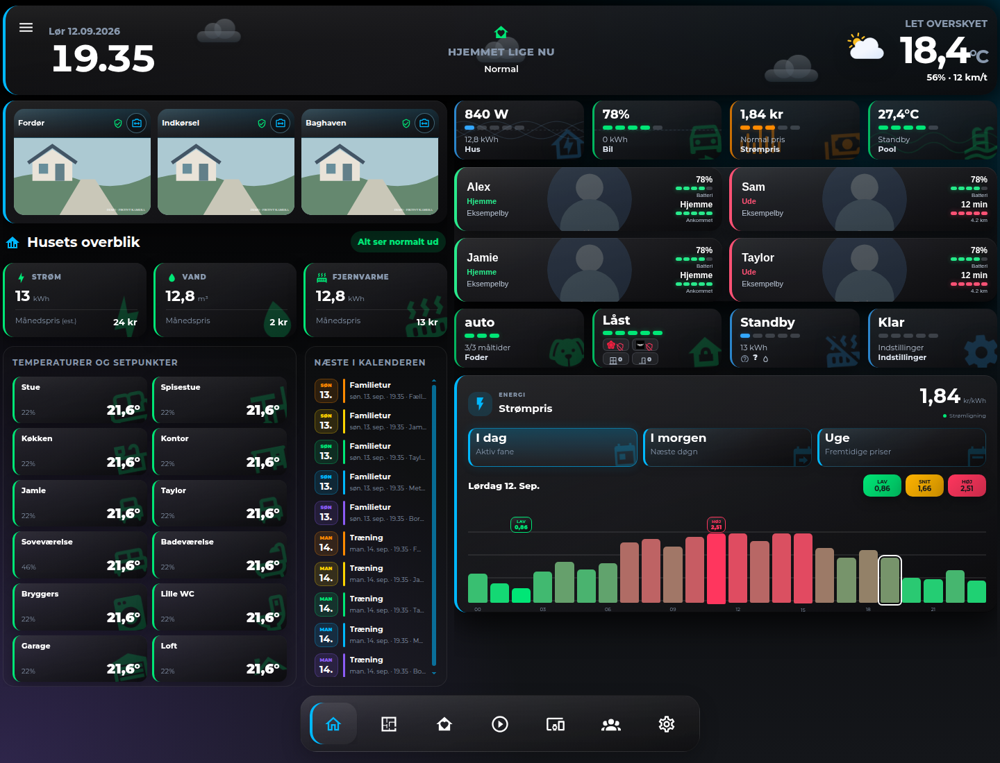
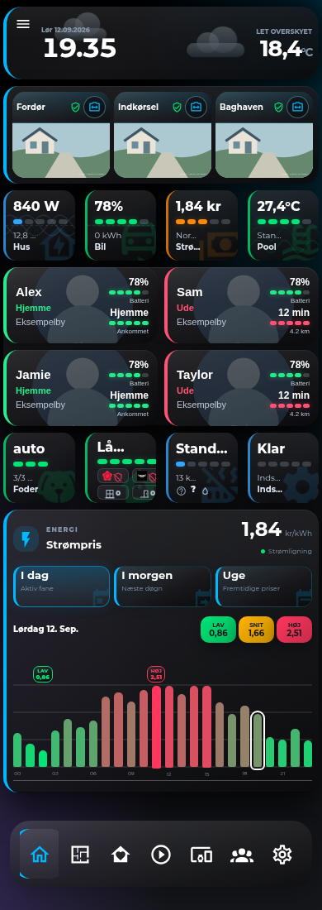
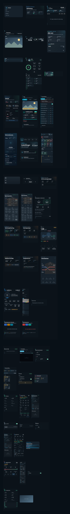

# HA Dashboard Hub

Oversigt over et Home Assistant-dashboard bygget stort set udelukkende af selvbyggede Lovelace-kort — ét lille JavaScript web component pr. kort, hver i sit eget repo. Dette repo er ikke selv et kort. Det er kortet over resten: hvilke kort der findes, hvor de bruges, og hvad de kan konfigureres med, så andre kan genskabe eller genbruge opsætningen.

## Forsiden

### Desktop



### Mobil



Forsiderne ovenfor er optaget fra den isolerede Home Assistant-demo med samme responsive opbygning som den rigtige installation. Personer, kameraer, lokationer, entities og værdier er erstattet med fiktive testdata, så hele dashboardets samspil kan vises uden at offentliggøre private oplysninger.

| Del af forsiden | Kort |
|---|---|
| Header, klokke, vejr og samlet husstatus | [`custom:ha-home-header-card`](docs/cards.md#ha-home-header-card) |
| Kamerafliser | [`custom:ha-home-camera-card`](docs/cards.md#ha-home-camera-card) |
| Strøm, vand, fjernvarme, rum og kalender | [`custom:ha-home-summary-card`](docs/cards.md#ha-home-status-card) |
| Bil, pool, foder, alarm og andre statusfliser | [`custom:ha-home-status-card`](docs/cards.md#ha-home-status-card) |
| Personer, lokation og batteristatus | [`custom:ha-person-overview-card`](docs/cards.md#ha-person-overview-card) |
| Strømpris og døgnets prisgraf | [`custom:ha-electricity-price-card`](docs/cards.md#ha-electricity-price-card) |
| Responsiv desktop-/mobilplacering | [`custom:ha-home-desktop-layout-card`](docs/cards.md#ha-home-status-card) |
| Navigation nederst | [`custom:navbar-card`](https://github.com/joseluis9595/lovelace-navbar-card) |

De enkelte kort, deres konfiguration og installationsrepositories findes i [kortkataloget](docs/cards.md). Flere komplette dashboardviews og screenshots tilføjes løbende.



## Mobile previews

Alle previews er renderet som rene kort ved 390 px mobilbredde. Navbar og resten af det private dashboard er ikke med, og alle personer, adresser, kameraer, entities og sensorværdier er fiktive demo-data.

- [Retvisende, anonymiseret mobilforside](docs/images/home-dashboard-mobile.png) — samme rækkefølge og tæthed som den virkelige forside, uden navbar-overlap
- [Rigtige HA-kort med test-entiteter](docs/images/home-dashboard-real-ha-test-entities.png) — optaget fra Home Assistant ved 390 px og beskåret uden HA-navigation
- [Forsidekort samlet](docs/images/home-cards-mobile.png)
- [Energi- og klimakort samlet](docs/images/energy-cards-mobile.png)
- [Teknik- og kontrolkort samlet](docs/images/tech-cards-mobile.png)
- [Komplet mobilgalleri](docs/images/all-cards-mobile.png)

Det enkelte korts repository indeholder desuden sit eget fulde billede som `docs/preview.png`. Generatoren i [`tools/generate-mobile-previews.mjs`](tools/generate-mobile-previews.mjs) gør billederne reproducerbare uden forbindelse til en rigtig Home Assistant-installation.

## Medfølgende ressourcer

Kortene må ikke være afhængige af udviklerens private `/local`-mapper. Vejrikonerne til `ha-home-header-card`, `ha-weather-card` og `hourly-weather-scroll-card` samt sikkerheds- og apparatikonerne til `ha-home-status-card` er derfor bundlet som importerede `*-assets.js`-filer i samme repository og release. En installation via HACS henter dermed både kortet og dets nødvendige billedressourcer.

## Hvad er det her

~50 kort, hver i egen mappe `www/ha-x-card/ha-x-card.js`, hver med sit eget GitHub-repo under [MRDonnii](https://github.com/MRDonnii?tab=repositories&q=&type=&language=&sort=name). Ingen fælles framework eller build-step — bare `customElements.define(...)`, indlæst direkte som en Lovelace-resource.

- **[docs/dashboards.md](docs/dashboards.md)** — hvilke kort der sidder på hvilken side.
- **[docs/cards.md](docs/cards.md)** — hvert korts formål, config-felter og link til dets repo.

## Arkitektur

**Filstruktur.** Hvert kort bor i `/config/www/ha-x-card/ha-x-card.js` og registreres som en Lovelace-resource:

```yaml
url: /local/ha-x-card/ha-x-card.js?v=0.4.0
type: module
```

Version-parameteren i URL'en er ikke kosmetisk — browseren cacher på den præcise URL, så enhver ændring i filen kræver et bump af `?v=` for at nå ud til klienterne. Hvert kort har en `const VERSION = "x.y.z"` øverst i filen, som bumpes ved enhver ændring.

**Render-mønster.** De fleste kort bruger et "render once, patch on change"-mønster: skallen (DOM + `<style>`) bygges én gang i `set hass()`, og der beregnes en kort signatur ud fra de entity-id'er kortet lytter på. Kortet gen-rendrer kun sit indhold når signaturen ændrer sig — ikke ved hvert `hass`-update fra Home Assistant.

**Config.** De fleste kort har enten:
- et fladt sæt navngivne felter (`title`, `entity`, ...) med fornuftige defaults, eller
- en `_DEFAULTS`/`SUMMARY_DEFAULTS`-konstant der merges med brugerens `setConfig(config)`, eller
- en `getConfigElement()` visuel editor (formularer i selve Lovelace-editoren) for de mest brugte kort.

En del kort accepterer også vilkårlige ekstra entity-felter og "gætter" selv hvilke der skal overvåges for state-ændringer (fri-form entity-felter, typisk alt der matcher et `domain.entity_id`-mønster).

**Fælles konventioner:**
- CSS custom properties med fallback-kæder (`var(--dashboard-accent, var(--info-color, #38bdf8))`), så kortene arver husets tema men falder tilbage på fornuftige farver uden det.
- Delte keyframes/klasser for baggrundsikoner (`.bg-icon`/`.utility-bg`, `drift`-animation) og status-badges (svag puls-animation) genbruges på tværs af kort for visuel konsistens, ikke via et fælles bibliotek — bare kopieret og holdt i sync manuelt.
- Rum-, sensor- og enhedsnavngivning følger husets egne konventioner (fx `binary_sensor.hps_<rum>_presence` for mmWave-tilstedeværelsessensorer) — se det enkelte korts config i [docs/cards.md](docs/cards.md) for hvilke entity-mønstre det forventer.

## Dashboards

| Dashboard | url_path | Indhold |
|---|---|---|
| Hjem Overblik | `hjem-overblik` | Forside: energi/vand/varme-status, kalender, personer, kameraer, rum, sikkerhed, pool, kæledyr |
| Energi Overblik | `energi-overblik` | Varmepumper, fjernvarme, ventilation, elpris, radiatorer, vejr |
| Teknik Overblik | `teknik-overblik` | Overvågning/Protect, robotter, servere, Tesla, sikkerhed |
| + Stue-varianter | `*-stue` | Samme kort, tilpasset layout til stuens skærm |
| Wall-panel / iPad kiosk | `wall-panel`, `ipad-kiosk` | Faste vægpaneler, kiosk-tilpasset visning |

Detaljeret kort-for-kort mapping: [docs/dashboards.md](docs/dashboards.md).

## Kort-katalog

Alle ~50 kort med formål, config og repo-link: [docs/cards.md](docs/cards.md).

Stort set alle kort er publiceret som selvstændige, installérbare repos (drop `.js`-filen i `www/`, tilføj som resource, brug `type: custom:ha-x-card` i en view). Kun én fil er holdt uden for GitHub, fordi den slet ikke er et kort — se noten i [docs/cards.md](docs/cards.md). Ét kort med hardcodede familienavne/adresse er ikke publiceret som den er, men findes genopbygget som et fuldt config-drevet, generisk kort under et andet navn.

## Sådan bygger du videre på det

1. Find det kort du vil bruge i [docs/cards.md](docs/cards.md) og klon dets repo.
2. Læg `.js`-filen i `/config/www/<kort-navn>/`.
3. Tilføj den som Lovelace-resource (Indstillinger → Dashboards → Ressourcer), med `?v=` i URL'en.
4. Tilføj et kort i en dashboard-view med `type: custom:<tag>` og de config-felter, kortets afsnit i `docs/cards.md` beskriver.
5. Match dine egne entity-id'er til de felter kortet forventer — de fleste kort er bygget generisk nok til at fungere med andre entity-navne end mine, men et par (typisk fri-form entity-mønstre) er skrevet specifikt til denne husstands enheder.

## Licens

MIT — se [LICENSE](LICENSE). De enkelte kort-repos har deres egen (identiske) licens.
